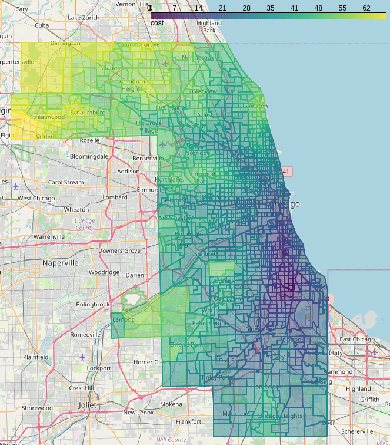

# I-GUIDE Forum 2023: CyberGIS-Compute Workshop

[View the notebook on CyberGISX Hub](https://cybergisxhub.cigi.illinois.edu/notebook/i-guide-forum-2023-cybergis-compute/).

**Authors:** Alexander Michels, Furqan Baig, Taylor Ziegler, Zimo Xiao, Mit Kotak, Anand Padmanabhan, Zhiyu Li, and Shaowen Wang

This repository runs through three notebooks to provide hands-on experience with CyberGIS-Compute:

1. [1-Intro.ipynb](1-Intro.ipynb) - A very simple notebook demonstrating a "hello world" example
2. [2-SpatialAccessibilityWithCyberGIS-Compute.ipynb](2-SpatialAccessibilityWithCyberGIS-Compute.ipynb) - Walking through a real-world application of calculating spatial accessibility with CyberGIS-Compute
3. [3-ContributingAModel.ipynb](3-ContributingAModel.ipynb) - A discussion of how the spatial accessibility model was created for CyberGIS-Compute.
